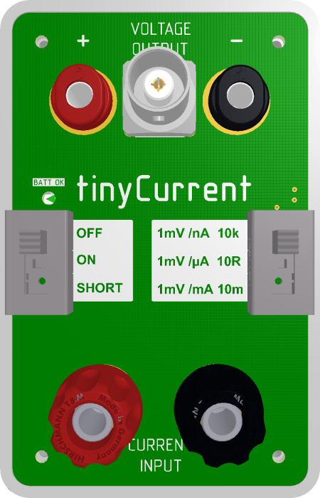

# tinyCurrent – an enhanced uCurrent Gold Derivative

A low cost yet professional low current measurement shunt and amplifier
combination to overcome the issue of high burden voltage as seen with
multimeters and to enable low current measurement by using voltage measurement
devices such as oscilloscopes.

Originally designed and sold by
[Dave Jones on the EEVBLOG](https://www.eevblog.com/projects/ucurrent/),
this derivative has several enhancements specifically for measuring varying
currents on today's low power devices.
Switch mode voltage regulators and the varying current draw of MCUs and RF
chips require the determination of the current draw over time to calculate the
total power consumption of a device. A storage oscilloscope is a perfect tool
for this task and widely available.
That's why the tinyCurrent features a **BNC connector to reduce the picked-up
noise** while measuring with an and oscilloscope. Another problem is the high
dynamics in power draw caused by the aforementioned reasons.
This is addressed by the possibility to
**power the device from an external source**
with up to 5.5 V and the possibility to tweak the device for a higher
maximum output voltage. Both measures combined lead to
**almost 3 times higher dynamic range**.

## Modifications to the original Design

### Highlights

- Added BNC output for even lower noise when acquiring with high sampling rate, high input impedance instruments like an oscilloscope. The effect is lower noise compared to normal banana leads.
See all <a href="scope_shots.md">scope shots</a> for comparison.
- Added a 2-pin 1.25 mm JST ZH style male header for powering the device externally to better use the device in permanent measurement setups. **Only use without battery**.
- Allow device to be fed with supply voltage of up to 5.5 V to increase the dynamic range (only when external power source us used).
- Added header J6 which allows to install a THT resistor or bond wire to change the ratio of the voltage divider R6/ R7 to increase the dynamic range for positive currents. R6/ R7 have a ratio of 1/ 5 to allow for a max. positive output voltage of ~80% of the supply voltage.
- "R-Variant" with reversed BNC connector optimized for attaching the device directly to an oscilloscope's input via a [BNC-to-BNC adapter](https://www.telegaertner.com/en/info/catalogue/coax/?IdTreeGroup=12989&IdProduct=3284).

### Other Differences

- Increased width of some traces
- Case and board shape to fit case
- Removed test traces on PCB on all 4 corners as they are antennas
- Banana plug sockets are _not_ gold plated → Testing shows that there is no measurable difference in conductivity
- Slide switches with lower current rating than in original design → Tests have shown that the used switch can easily handle 5V/ 6A which should be far enough for this device
- Shunt resistor R9 has 0.05% greater tolerance → Parts are hand selected using 7 1/2 Digit DMM with 4 wire measurement in 100 Ohm range
- Pads for C5, C6 to fit caps on the virtual ground rails to prevent oscillation with capacitive loads
- Some other BoM changes without negative implications

## Specifications

<table class="vclTable">
  <tr>
    <th colspan="3" style="text-align: left;">
      Min/Max Current per Range
    </th>
  </tr>
  <tr>
    <td>
      Dynamic Range
    </td>
    <td colspan="2">
      In general, the dynamic range in one direction can be determined by: <code>VDD / 2 - 200 mV (security margin) = X mV</code>. In case of <code>VGND = VDD / 2</code>.
    </td>
  </tr>
  <tr>
    <td colspan="3">
      @2.9V VDD (mean battery voltage over usage time)
    </td>
  </tr>
  <tr>
    <td>
      nA
    </td>
    <td colspan="2">
      ± 1250 nA (20 µV / nA burden voltage typical), contact resistance plays a role here. 10 µV due to the shunt resistor.
    </td>
  </tr>
  <tr>
    <td>
      µA
    </td>
    <td colspan="2">
      ± 1250 µA (10 µV / µA burden voltage)
    </td>
  </tr>
  <tr>
    <td>
      mA
    </td>
    <td colspan="2">
      ± 1250 mA (10 µV / mA burden voltage)
    </td>
  </tr>
  <tr>
    <td colspan="4">
      @5.5V VDD (from external power source)
    </td>
  </tr>
  <tr>
    <td>
      nA
    </td>
    <td colspan="2">
      ± 2550 nA (20 µV / nA burden voltage typical), contact resistance plays a role here. 10 µV due to the shunt resistor.
    </td>
  </tr>
  <tr>
    <td>
      µA
    </td>
    <td colspan="2">
      ± 2550 µA (10 µV / µA burden voltage)
    </td>
  </tr>
  <tr>
    <td>
      mA
    </td>
    <td colspan="2">
      ± 2550 mA (10 µV / mA burden voltage)
    </td>
  </tr>
  <tr>
    <th style="text-align: left;">
      Resolution in nA Range
    </th>
    <td colspan="3">
      1000 pA on a 3.5 digit DMM 
      100 pA on 4.5 digit DMM 
      10 pA 5.5 digit DMM
    </td>
  </tr>
  <tr>
    <th style="text-align: left;">
      Accuracy, typical
    </th>
    <td colspan="3">
      &lt; ±0.05% on µA and nA ranges 
      &lt; ±0.1% on mA range
    </td>
  </tr>
  <tr>
    <th style="text-align: left;">
      Output Offset Voltage, maximum
    </th>
    <td colspan="3">
      &lt; ±30 µV
    </td>
  </tr>
  <tr>
    <th style="text-align: left;">
      Temperature Drift
    </th>
    <td colspan="3">
      &lt; 10 ppm / degC (µA / nA) 
      &lt; 15 ppm / degC (mA)
    </td>
  </tr>
  <tr>
    <th style="text-align: left;">
      Noise
    </th>
    <td colspan="3">
      &lt; -90 dBV
    </td>
  </tr>
  <tr>
    <th style="text-align: left;">
      THD
    </th>
    <td colspan="3">
      &lt; -60 dB
    </td>
  </tr>
  <tr>
    <th style="text-align: left;">
      Power Supply
    </th>
    <td colspan="3">
      CR2032 Lithium coin cell <b>or</b> max 5.5 V through connector J5
    </td>
  </tr>
  <tr>
    <th style="text-align: left;">
      Battery Life
    </th>
    <td colspan="3">
      &gt;50 hours (battery good LED ensures accurate measurement when LED is on). 2.65 V cutout voltage.
    </td>
  </tr>
  <tr>
    <th style="text-align: left;">
      Certifications
    </th>
    <td colspan="3">
      CE
    </td>
  </tr>
  <tr>
    <th style="text-align: left;">
      Materials
    </th>
    <td colspan="3">
      RoHS, REACH
    </td>
  </tr>
</table>

Similar to the [original uCurrent Gold specs](https://www.eevblog.com/projects/ucurrent/).

## Maximum Ratings

- Maximum supply voltage: 5.5 V
- Maximum current through input ports: 5 A

In order to keep the burden voltage low, this device has no
**OVERLOAD PROTECTION**. That means **NO FUSES**. Care is required in
using the unit to prevent damage.

## Schematics and PCB Design

All source files are [available on Github](https://github.com/nfhw/tinycurrent).
The schematics and PCB layout are in Altium Designer format.

## Kit Contents

- tinyCurrent PCB and case plus 4 screws
- **no** battery, you need a CR2032 coin cell battery

## Usage

1. If you supply power via J5, make sure the noise level is lower than the expected output voltage.
**Too much noise on the supply voltage will render any measurement useless. Usually primary cells (batteries) are the best choice for this**.
2. Connect the device under test in loop **on the low side** so that the current flow is from **+** to **-**.
3. Connect a suitable voltage measurement device such as a DMM or an Oscilloscope on the output side.
4. Turn on the device and read the current on the voltage measurement device in the mV range as if it were mA/µA/nA.

## Where to buy?

Pick it up ready to use from the [n-fuse website](https://www.n-fuse.co/devices/tinyCurrent-precision-low-Current-Measurement-Shunt-and-Amplifier-Device.html).

## Licenses

### Circuit Schematics

The circuit schematics of this project are made available under the
[CC-BY-SA](https://creativecommons.org/licenses/by-sa/3.0/) license.

### Hardware Design

 Open source hardware.

### Miscellenious

Data sheets, Altium libraries, 3D Models are subject to vendor specific
licensing.
