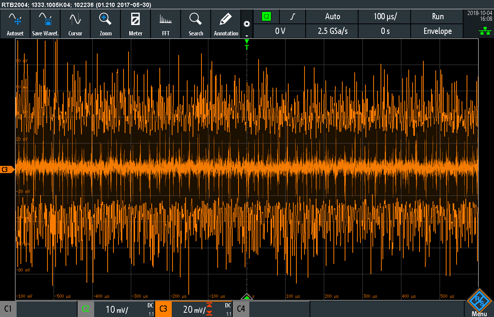
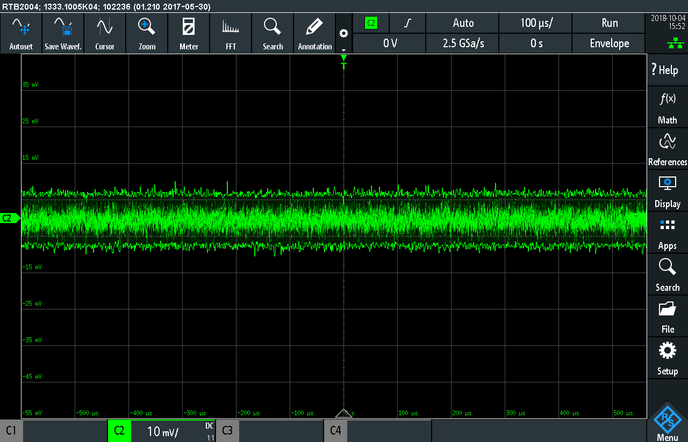

# Scope Shots to highlight the Benefits of the tinyCrrent's Design

## Coax Cable vs. Banana Leads

This comparison shows the effect of using a Coax cable (using the BNC output connector)
to connect the tinyCurrent to a scope compared to normal banana plug leads of approximately the same length.
Both cable types are wired to an input channel configured in 1:1 mode.

**Input Short, Output Noise with Banana Leads**

**Input Short, Output Noise with Coax Cable**

